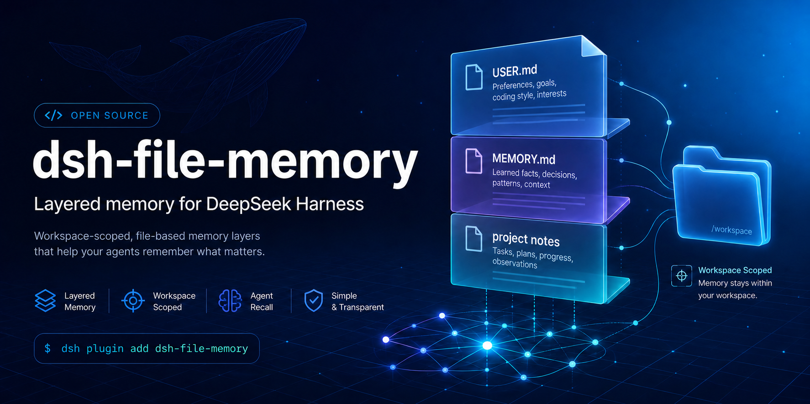

# dsh-file-memory

[](https://www.npmjs.com/package/dsh-file-memory)

English | [中文](README.zh.md)

An installable DSH profile bundle for WorkBuddy-style layered memory: global persona and memory files, live explicitly bound workspace memory, skip-aware reminders and background consolidation, hybrid session recall, post-compaction flush, and a bundled usage skill. This repository is the standalone Git distribution of the implementation developed in DeepSeek Harness. Since v1.2.1 the package is published as `dsh-file-memory`.

## Install or remove

The expected user already runs an [official DeepSeek Harness source checkout](https://github.com/deepseek-ai/deepseek-harness) and may already have chats, model/provider settings, workspaces, and a `web` profile. Stop the running DSH process, then run the install from that same checkout root and from an environment with the same `DSH_HOME` used to start DSH:

```sh
pnpm dsh plugin --profile web add github:aqsk-BLG/dsh-memory#v1.2.1
pnpm dsh --profile web --dump-config
pnpm dsh web
```

Use `github:aqsk-BLG/dsh-memory` to follow the repository head, or replace the `v1.2.1` tag with an exact commit SHA for the strongest reproducibility. A globally installed CLI may use `dsh ...` instead of `pnpm dsh ...`.

Once published to npm, the registry package name is `dsh-file-memory`:

```sh
pnpm dsh plugin --profile web add dsh-file-memory
```

Or install from a release tarball: download `dsh-file-memory-1.2.1.tgz` from the assets of the [v1.2.1 release](https://github.com/aqsk-BLG/dsh-memory/releases/tag/v1.2.1), then:

```sh
pnpm dsh plugin --profile web add ./dsh-file-memory-1.2.1.tgz
```

> **Naming note.** Since v1.2.1 this package is published as **`dsh-file-memory`**. The npm name `dsh-memory` is a different, unrelated package — do not install that one by mistake.

`dsh plugin` updates only the existing profile's dependency metadata, lockfile, installed modules, and `dsh.profile.bundles` list. It does not modify the DSH source tree, create another agent or workspace, or reset existing sessions, models, settings, storage, or workspace registrations. The bundle also leaves `dshHome` unset, so the plugin uses the exact same single data root as the DSH instance: inherited `$DSH_HOME`, or DSH's own `~/.dsh` default only when that variable is unset. It never opens both roots.

The bundle inserts the `memory` row and enables the session-query index at `$DSH_HOME/session-query.sqlite`; later profile and home patches may override either row. The repository commits its built `lib/index.js`, so installation does not need a dependency lifecycle build. Remove both the dependency and layer, then restart DSH, with:

```sh
pnpm dsh plugin --profile web remove dsh-file-memory
```

The public repository is discoverable through GitHub's [`dsh-plugin` topic](https://github.com/topics/dsh-plugin).

## Host version support

On load the facade checks the DeepSeek Harness release version against a floor. The version is read from the lockstep `@deepseek-ai/*` package manifests installed next to the plugin (the official releases all carry the same version string) or from an explicit `DSH_VERSION` environment variable.

- **Tested floor: `0.1.0-rc.7`.** All peer APIs this plugin uses (`agent/created`, system-prompt sections, the workspace registry, session-query injection, compaction flush) were validated against this release.
- **At or above the floor** — one info log line, nothing else.
- **Below the floor** — the facade fails to load with a loud error naming the detected and required versions. Downgrade to a warning with `versionGate: 'warn'` (or silence with `'off'`) only if you maintain a compatible fork.
- **Version undetectable or unparseable** — warn and continue. An unknown version is not proof of incompatibility, so a hidden version never hard-crashes the plugin.

## First run

When `$DSH_HOME` does not yet contain `USER.md`, `MEMORY.md`, `IDENTITY.md`, or `SOUL.md`, the plugin seeds short starter templates with `<!-- -->`-free plain Markdown and a comment explaining each file's role. Seeding is exclusive-create: existing files are never overwritten, renamed, or reformatted, and no existing session is touched. Nothing else is forced on a first run — no memory build, no history consolidation, and no writes beyond those four small files plus the lazy `session-query.sqlite` index that opens on the first search. Templates can be disabled with `seedMissingPersonaFiles` / `seedMissingMemoryFiles`.

## Coexistence with other plugins and models

- **Thin cordis patch.** The bundle's `cordis.patch.yml` only inserts the `memory` row and the `session-query-sqlite` row (lazily opened at `$DSH_HOME/session-query.sqlite` on the first search). Profile and home patch layers still apply afterwards and may override either row. Removing the dependency removes both.
- **No custom session events.** Since v1.1.0 the plugin appends no events outside the official catalog, so stock harnesses never refuse its sessions and other plugins' event handling is unaffected.
- **Other plugins keep their rows.** The facade registers under the single `memory` name and the `skills` injection; internal parts use namespaced names (`persona-files`, `memory-bootstrap`, `tool-session-search`, `memory-flush`, `memory-consolidator`). A project or preset can override the bundled `memory` skill with a same-named skill.
- **Model-route sharing.** Semantic recall and background consolidation reuse the session's current model route by default; dedicated `semanticProvider`/`semanticModel` and `consolidationProvider`/`consolidationModel` pairs are optional and never reconfigure other plugins' routes. Disabling `semanticEnabled` keeps recall local and full-text-only.
- **No second data root.** The bundle leaves `dshHome` unset and always resolves the same home the hosting DSH instance uses.

## Migrating from v1.0.x

v1.0.x wrote four custom session events (`memory/bootstrap`, `persona/bootstrap`, `memory/consolidation-request`, `memory/consolidation-result`). v1.1.0 replaced them with file-backed state; v1.2.0 keeps that model. Upgrade steps:

1. Stop DSH.
2. Install the new tag (`github:aqsk-BLG/dsh-memory#v1.2.1`), or keep the running version and just strip the legacy events below.
3. Stock harnesses refuse to reopen v1.0.x logs until the legacy events are marked ignorable or stripped. With DSH stopped, run:

   ```sh
   node scripts/migrate-legacy-events.mjs "$DSH_HOME/sessions" --apply
   ```

   Zstandard-compressed logs need the harness source for its internal codec: add `--harness-source <path-to-deepseek-harness-checkout>`. The default dry-run reports what would change; backups are written next to each rewritten log.
4. On first load the plugin folds any surviving legacy `memory/consolidation-result`/`-request` events into a fresh per-session consolidation state file under `$DSH_HOME/memory/consolidation/<session-id>.json` (safe: sequence numbers are stable, daily appends are idempotent per marker, and unchanged managed-region rewrites are noops), then writes only files from then on.
5. Start DSH and verify the log line naming the detected host version.

See [Durability model](#durability-model) for the full state layout.

## What it does

Mounting the bundle composes five bundled capabilities and the guide:

- **Persona files** — seeds and injects frozen `$DSH_HOME/IDENTITY.md` and `$DSH_HOME/SOUL.md` snapshots.
- **Memory bootstrap** — injects frozen global `USER.md` and `MEMORY.md`, live project `MEMORY.md`, and a lightweight every-turn reminder that skips greetings, simple lookups, and short Q&A.
- **Background consolidator** — reviews each eligible completed task on the next idle transition, writes bounded managed regions with conflict checks, and appends idempotent daily project notes only for the still-bound workspace. Greetings and short Q&A are skipped; a larger batching cadence remains an opt-in cost control. A guarded destructive rewrite retains old entries while applying bounded safe additions; retryable mixed results retain their watermark, malformed regions wait for repair, and transient failures back off. The watermark and retry control are file-backed (see Durability model below).
- **Hybrid session search** — semantically ranks bounded past-session surfaces when a model route is available, accepts legitimate empty shards in large tournaments, and provides an explicitly labeled full-text fallback.
- **Compaction flush** — queues a post-compaction reminder to persist important context at the permitted memory layer.
- A bundled `memory` runtime skill — explains file roles, what to record and skip, append-only daily logs, semantic recall, and the 30-day distillation rule. A project or preset may override it with a same-named skill.

The standalone build compiles all five capabilities into one `lib/index.js` and leaves only DSH host packages as runtime peers. Persona files remain a separate identity concern internally even though the facade installs them together with memory.

## Durability model

Since v1.1.0 the plugin writes **no custom session events**. Official DeepSeek Harness builds refuse to interpret session logs containing event types outside their catalog unless the event carries the `ignorable` envelope marker (`SessionFormatUnsupportedError`), and `Session.append` cannot set that marker — so durable state must not depend on custom catalog events. Community users on a pure official DSH never hit the refusal because this plugin never appends `memory/bootstrap`, `persona/bootstrap`, `memory/consolidation-request`, or `memory/consolidation-result`.

File-backed state instead lives under the active DSH home:

- `$DSH_HOME/memory/consolidation/<session-id>.json` — per-session consolidation state: the durable watermark (highest turn `endSeq` fully covered by an advancing review), the last review result (status, outcomes, retry control, error), and a compact record of the last prepared review request. Written atomically after each review; the watermark advances only for results whose status allows it, so a partial failure keeps the batch for a controlled retry exactly like the v1.0.x event log did.
- `$DSH_HOME/USER.md`, `$DSH_HOME/MEMORY.md`, `$DSH_HOME/IDENTITY.md`, `$DSH_HOME/SOUL.md` — unchanged, as today. Managed regions inside memory files keep working exactly as before.

Sessions written by v1.0.x still carry the legacy events. When a hosting harness can already decode them (for example a patched build with the old vocabulary), the plugin folds the last legacy result/request events into a fresh state file on first load and then writes only files. Because sequence numbers are stable, daily appends are idempotent per marker, and managed-region rewrites of unchanged entries are noops, a rebuilt watermark is safe.

Sessions whose logs were written by v1.0.x cannot be reopened by a stock harness until the legacy events are marked ignorable or stripped. With DSH stopped, run:

```sh
node scripts/migrate-legacy-events.mjs "$DSH_HOME/sessions" --apply
```

Zstandard-compressed logs need the harness source for its internal codec: add `--harness-source <path-to-deepseek-harness-checkout>`. The default dry-run reports what would change; backups are written next to each rewritten log.

## Workspace authority

Project memory exists only when the session is explicitly attached to a registered workspace. At every prompt assembly, the bootstrap resolves the current session id through `ctx.workspaceRegistry.list()` and emits a live `MEMORY SCOPE` containing the exact project-memory directory and bounded `.dsh/memory/MEMORY.md` content. Dated `.dsh/memory/YYYY-MM-DD.md` logs remain on-demand.

A session with no matching membership — including the Web UI's Ungrouped group — receives global memory and session recall only. The plugin never infers ownership from `cwd`, never scans all workspaces, never auto-registers the source checkout, and never deletes project memory when a workspace registration is removed.

## Configuration

| Key | Default | Meaning |
|---|---|---|
| `dshHome` | unset | Advanced explicit override only. Normally omit it so the plugin uses the same root already selected by DSH: `$DSH_HOME`, otherwise DSH's default `~/.dsh` |
| `versionGate` | `error` | Host-version gate at load: `error` fails loud on hosts below `0.1.0-rc.7`, `warn` logs instead, `off` disables the check |
| `memoryBudgetChars` | `4000` | Code-point budget for global `MEMORY.md` |
| `userBudgetChars` | `1500` | Code-point budget for global `USER.md` |
| `projectMemoryBudgetChars` | `3000` | Code-point budget for live project `MEMORY.md` |
| `reminderEnabled` | `true` | Include the skip-aware every-turn memory reminder |
| `memorySectionOrder` | `5` | Frozen global-memory prompt order |
| `identityBudgetChars` | `4000` | Code-point budget for `IDENTITY.md` |
| `soulBudgetChars` | `4000` | Code-point budget for `SOUL.md` |
| `seedMissingPersonaFiles` | `true` | Seed conservative persona defaults when absent |
| `seedMissingMemoryFiles` | `true` | Seed short `USER.md`/`MEMORY.md` templates when absent; never overwrites |
| `personaSectionOrder` | `-50` | Persona-file prompt order before deployment persona |
| `maxHits` | `20` | Maximum sessions one `session_search` call may return |
| `semanticEnabled` | `true` | Use semantic ranking when a model route is available |
| `semanticProvider` | `""` | Optional dedicated semantic provider, paired with `semanticModel` |
| `semanticModel` | `""` | Optional dedicated semantic model, paired with `semanticProvider` |
| `semanticBatchSize` | `30` | Candidates per semantic-ranking request |
| `semanticCandidateChars` | `2000` | Code-point budget retained from each past session |
| `semanticMaxTokens` | `2048` | Output-token cap for each ranking request |
| `semanticReadConcurrency` | `4` | Concurrent past-session surface reads |
| `semanticFallbackEnabled` | `true` | Use and label full-text fallback when semantics cannot run |
| `flushEnabled` | `true` | Queue the reminder after successful compaction |
| `consolidationEnabled` | `true` | Run skip-aware reviews after eligible completed turns |
| `consolidationMode` | `automatic` | Write controlled regions or log `proposal` candidates only |
| `consolidationEveryEligibleTurns` | `1` | Eligible completed tasks per ordinary review batch; raise above one only to opt into batching |
| `consolidationMinUserChars` | `12` | Minimum human code points for a non-tool turn |
| `consolidationMinAssistantChars` | `24` | Minimum assistant code points for a non-tool turn |
| `consolidationMaxTurnsPerReview` | `20` | Maximum eligible turns in one review |
| `consolidationTranscriptBudgetChars` | `12000` | Bounded review transcript text |
| `consolidationDailyBudgetChars` | `1200` | Daily append budget per review |
| `consolidationMaxTokens` | unset | Advanced route override only; normally omit it so the selected model adapter supplies its native output limit |
| `consolidationReasoningEffort` | unset | Normally inherit the live session's effort on the same route, or the dedicated route's adapter default |
| `consolidationTimeoutMs` | `180000` | End-to-end background-review deadline in milliseconds |
| `consolidationMaxDeletionRatio` | `0.5` | Larger automatic managed-list deletions become proposals; a full clear is always protected unless explicitly requested |
| `consolidationRetryBaseDelayMs` | `60000` | Initial transient-failure retry delay |
| `consolidationRetryMaxDelayMs` | `3600000` | Maximum transient-failure retry delay |
| `consolidationProvider` | `""` | Optional dedicated review provider, paired with `consolidationModel` |
| `consolidationModel` | `""` | Optional dedicated review model, paired with `consolidationProvider` |

For a raw Cordis composition rather than a profile bundle:

```yaml
- name: dsh-file-memory
  config:
    reminderEnabled: true
    semanticEnabled: true
    flushEnabled: true
    consolidationEnabled: true
```

## Export shape

A function/namespace plugin: it exports `name` / `inject` / `Config` / `apply` and no default.

## Model Experience

### Prompt context, recall tool, and skill catalog

#### What the model sees

Every session receives frozen persona and global-memory sections. Each request also receives a live `MEMORY SCOPE`: either one exact workspace plus its curated `MEMORY.md`, or an explicit statement that project memory is unavailable. The compact reminder distinguishes substantive project work from greetings and short Q&A. After an eligible turn, a separate tools-free reviewer receives bounded transcript and file evidence; its output never enters the conversation. `session_search` exposes evidence and its actual ranking mode, while the complete file policy is available on demand as the `memory` skill.

#### Token effect

Persona and global snapshots spend bounded prompt tokens on every request. The live scope adds a bounded project snapshot and short reminder only where authorized. Daily logs and the full skill cost tokens only when read. Semantic recall makes separate bounded model calls only when the tool is invoked. Background consolidation makes one auxiliary call after each eligible completed task becomes idle by default; greetings and short Q&A are filtered first. The reviewer keeps the selected route's reasoning capability and returns only incremental `add`/exact-`remove` patches plus new daily notes. The plugin imposes no fixed output-token cap by default: the model adapter's native route limit remains the transport boundary, while the final `USER.md`, global/project `MEMORY.md`, and daily append character budgets are the write authority. A visible-JSON circuit breaker is calculated from those same file budgets and does not count hidden reasoning. Each successful batch schedules the next pending batch while the agent remains idle, so old tasks are drained without being packed into one oversized request. Operators who prefer fewer calls can raise `consolidationEveryEligibleTurns`, while explicit remember and forget requests still bypass batching.

#### KV Cache effect

Persona and global sections are frozen per session and prefix-stable. Workspace membership, curated project memory, and reminders travel in the dynamic runtime-context channel. Tool calls and loaded skill content append after the reusable prefix.

## Requirements and provenance

- DeepSeek Harness `>= 0.1.0-rc.7` (tested on `0.1.0-rc.7`) providing the declared `@deepseek-ai/*` peer packages. Older hosts fail the load-time version gate by default; see [Host version support](#host-version-support).
- Node `^22.19.0 || >=24`.
- CI runs `pnpm check` (typecheck, bundle build, and the policy check scripts) on Node 22 and 24 for every push and pull request.

This package is a standalone distribution of `packages/memory/*` and `packages/identity/persona-files` from [DeepSeek Harness](https://github.com/deepseek-ai/deepseek-harness), licensed under MIT. See [THIRD_PARTY_NOTICES.md](THIRD_PARTY_NOTICES.md).

## Known Limitations and Deferred Work

- **Frozen home files per session** — edits to `IDENTITY.md`, `SOUL.md`, `USER.md`, or global `MEMORY.md` enter existing model context only in a new session (v1.0.x additionally logged per-session snapshot events; v1.1.0 reads the files directly and a resumed session re-snapshots them).
- **No daily-log injection** — dated project history remains on-demand even though curated project memory is live.
- **No historical daily-log distillation yet** — the background consolidator reviews newly completed turns; 30-day daily-log distillation remains a manual maintenance rule.
- **Proposal mode is inspection-only** — there is no later approve/apply command or UI.
- **Deletion guard proposals require manual follow-up** — in automatic mode, bounded safe additions are written while guarded old entries are retained; the materialized candidates and target outcomes remain in the consolidation state file. If retaining old entries plus every addition would exceed the target budget, nothing is written and the proposal remains inspection-only.
- **Provider-visible semantic candidates** — semantic recall sends bounded past-session excerpts to the selected model provider; disable it for local full-text-only recall.
- **No cross-device corpus or cloud sync** — session discovery and full-text fallback use the composed DSH session-query store; cloud synchronization remains an optional future layer.

## License

[MIT](LICENSE)
